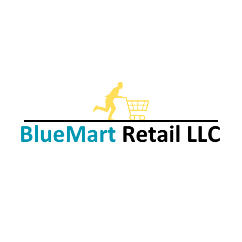

# **BlueMart Retail LLC — 2025 Analytics Project Story**

---

## **Company Overview**

BlueMart Retail LLC is a UAE-based omnichannel retailer operating **30 stores** across Dubai, Abu Dhabi, and Sharjah, complemented by an e-commerce presence via its website, mobile app, and marketplaces such as Amazon.ae and Noon.

* **Products**: ~5,000 SKUs across Grocery, Beverages, Personal Care, Household, Snacks, Dairy, and Electronics.  
* **Customers**: ~10,000 unique customers in 2025, segmented into loyalty tiers (Silver, Gold, Platinum).  
* **Objective**: Integrate physical and digital channels, optimize inventory, and leverage analytics for actionable business decisions.

---

## **Business Challenge**

BlueMart faces **typical mid-sized retailer challenges**:

* Maintain **optimal stock levels** across 30 stores despite SKU rotation, slow movers, and seasonal spikes (Ramadan, Eid, Dubai Shopping Festival, Black Friday, National Day).  
* Forecast **SKU-level demand** to prevent stockouts or overstock.  
* Understand **customer behavior** and **channel preferences** for retention and targeted campaigns.  
* Evaluate **channel performance** (store, website, mobile, marketplaces) for revenue optimization.  
* Assess **promotion ROI** and seasonal impact on margins.  
* Handle **real-world data complications**: missing customer IDs, stockouts, partial fulfillment, and inconsistent discount application.

---

## **Project Goal**

Build a **KPI-driven analytics framework** to:

1. Provide **holistic visibility** into sales, inventory, promotions, and customer behavior.  
2. Forecast **SKU-level demand** and recommend **safety stock levels**.  
3. Identify **high-value customers** and preferred channels.  
4. Enable management to make **data-driven decisions** improving revenue, gross margin, and operational efficiency.  
5. Deliver insights via **executive-ready dashboards and reports**.

---

## **Dataset Overview**

**Time Period:** Jan 1 – Dec 31, 2025 (daily granularity)  
**Stores:** 30 (Mall, High Street, Community)  
**SKU Universe:** 5,000 SKUs; each store actively sells 1,000–1,500 SKUs/month  
**Customers:** 150–200 per store per day; basket size 5–7 SKUs  
**Channels:** Store (~70%), Website, Mobile App, occasional marketplaces  

| Table              | Description                                                                                   | Size         |
| ------------------ | --------------------------------------------------------------------------------------------- | ------------ |
| Store Master       | store_id, store_name, city, store_type, opening_date                                          | 30 rows      |
| SKU Master         | sku_id, sku_name, category, subcategory, unit_price, cost_price, brand                        | 5,000 rows   |
| Customer Master    | cust_id, age, gender, city, loyalty_segment, preferred_channel, registration_date             | ~10,000 rows |
| Sales Transactions | date, store_id, sku_id, customer_id, quantity, unit_price, total_value, channel, discount_pct | ~1–1.5M rows |
| Inventory Snapshot | store_id, sku_id, stock_on_hand, reorder_point, safety_stock, last_restock_date               | ~20,000 rows |
| Promotions         | promo_id, promo_name, start_date, end_date, discount_pct, promo_type                          | ~100 rows    |

**Realism Built-In:**

* SKU rotation; not all SKUs sell daily  
* Random stockouts and partial fulfillment  
* Missing customer IDs for anonymous purchases  
* Promotions and discounts applied variably  

---

## **Key KPIs**

| KPI                            | Description                    | Source / Calculation             | Dashboard Placement                |
| ------------------------------ | ------------------------------ | -------------------------------- | ---------------------------------- |
| **Total Revenue**              | Overall sales                  | qty × unit_price                 | Executive summary & trends         |
| **Gross Margin %**             | Profitability                  | (Revenue – COGS)/Revenue ×100    | Revenue vs cost analysis           |
| **Sales by Channel**           | Revenue per channel            | channel attribute                | Channel comparison charts          |
| **Inventory Turnover**         | Stock efficiency               | COGS / Avg Inventory             | Heatmap by SKU/store               |
| **Stockout Rate / Fill Rate**  | % demand met                   | Inventory snapshot + sales       | KPI cards / alerts                 |
| **Average Basket Value (ABV)** | Avg transaction value          | Revenue / #Transactions          | Trends by channel & loyalty tier   |
| **Sell-through %**             | % stock sold                   | Units sold / Units received ×100 | SKU-level dashboards               |
| **Promotion ROI**              | Incremental sales per discount | Sales uplift vs discount cost    | Promotion planning                 |
| **Customer Retention Rate**    | Repeat purchase behavior       | Repeat / Total customers         | Loyalty program evaluation         |
| **Forecast Accuracy (MAPE)**   | Demand prediction              | Predicted vs actual sales        | Planning & replenishment dashboard |

---

## **Analytical Approach**

1. **Data Acquisition & Cleaning**  
   * Generate realistic 1-year sales transactions  
   * Handle missing customer IDs, stockouts, inconsistent discounts  
   * Standardize SKU, store, and channel attributes  

2. **Exploratory Data Analysis (EDA)**  
   * Examine **sales trends** (daily, monthly, seasonal)  
   * Analyze **SKU & category performance**, promotions impact  
   * Explore **customer behavior**, ABV, loyalty tiers, and channel preference  

3. **KPI Calculation & Aggregation**  
   * Revenue, GM%, ABV, sell-through, stockouts, retention  
   * Aggregated by store, channel, SKU, category, and month  

4. **Forecasting & Inventory Optimization**  
   * Predict next quarter SKU demand using **XGBoost/LightGBM**  
   * Recommend **safety stock levels** per SKU/store  

5. **Visualization & Reporting**  
   * **Streamlit Dashboard** with:
     * Executive Overview: revenue, GM%, ABV trends, stockout alerts  
     * Channel Insights: store vs e-commerce, marketplace contributions  
     * Inventory & Supply Chain: turnover, sell-through, safety stock  
     * SKU & Category Performance: top/bottom SKUs, promotion impact  
     * Forecast & Planning: predicted demand, MAPE, actionable replenishment suggestions  
     * Customer Insights: cohorts, loyalty segmentation, repeat purchase trends  

6. **Insights & Recommendations**  
   * Stakeholder-specific recommendations for Sales, Marketing, Inventory, and Executive teams  
   * Executive-ready summaries with clear headlines (e.g., “Sales peaked in Ramadan due to Grocery and Beverages promotions; slow movers identified in Electronics require targeted campaigns”)  

---

## **Expected Deliverables**

1. **Cleaned & annotated dataset** (all tables)  
2. **KPI tables & trend analysis**  
3. **Forecasting outputs** (SKU demand & safety stock)  
4. **Streamlit dashboard** (interactive, stakeholder-ready)  
5. **Insight report** with actionable recommendations  
6. **Portfolio presentation / Loom walkthrough** for hiring manager demonstration  

---

## **Why This Project Stands Out**

* **Realistic Retail Context**: Reflects actual mid-sized retailer operations and constraints  
* **Analytical Rigor**: Covers EDA, KPI calculation, forecasting, and optimization  
* **Actionable Insights**: Recommendations mapped to stakeholders  
* **Portfolio-Ready**: Clean visualizations, executive summaries, and storytelling  
* **Memory-Efficient & Scalable**: 1-year dataset with 30 stores, ~1–1.5M transactions  

---

This project mirrors **what a real business analyst would do**, incorporates **realistic retail assumptions**, aligns with **hiring manager expectations**, and creates **portfolio-ready outputs**.
